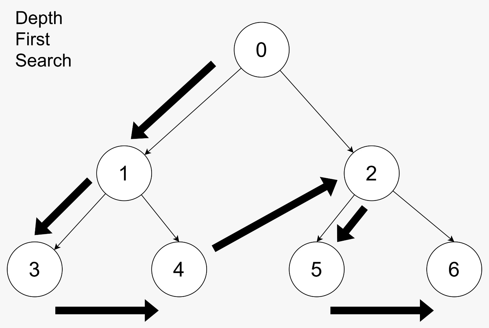

When working with graphs and trees, two fundamental algorithms comes to mind. **Depth-First Search (DFS)** and **Breadth-First Search**.

If you've ever wondered what the differences between DFS and BFS, you are in the right place. In this blog post I will try to breakdown **DFS** vs **BFS**,
explain their key differences, use cases, and code samples in JavaScript.

### What is Depth-First Search (DFS)?
DFS is one of the graphs traversal algorithms that explores as far as possible down one branch before backtracking.
It's like a person walking through a maze, who follows one path to the end before returning to explore other options.

#### Key Features of DFS:
- **Traversal Type**: Depth-First, explore one branch deeply before finding other options.
- **Data Structure**: Uses a stack (LIFO - Last In, First Out) to keep track of visited nodes.
- **Use Cases**: DFS is great for problems like solving maze, puzzles, or when we need to exhaustively explore all solutions before deciding.

***

### What is Breadth-First Search (BFS)?
BFS is another fundamental graph traversal algorithm. Instead of going deep into one branch, it explores all possible neighbors at each level before moving deeper into the graph.
Picture someone exploring a city by first visiting all streets directly connected to them before moving to the next level of streets.

#### Key Features of BFS:
- **Traversal Type**: Breadth-first (explores all neighbors at the same level first).
- **Data Structure**: Uses a queue (FIFO - First In, First Out) to maintain the order of nodes.
- **Use Cases**: BFS is ideal when you need to find the shortest path or finding the distance between nodes.

***

### DFS vs BFS: Key Differences
export const differenceList = [
    {
        feature: 'Search Strategy',
        dfs: 'Goes deep into a branch before backtracking',
        bfs: 'Explores neighbors first, then their neighbors'
    },
    {
        feature: 'Data Structure',
        dfs: 'Stack (LIFO)',
        bfs: 'Queue (FIFO)'
    },
    {
        feature: 'Use Case',
        dfs: 'Good for deep recursive problems or exhaustive searches',
        bfs: 'Good for finding shortest paths and level-by-level exploration'
    },
    {
        feature: 'Path Finding',
        dfs: 'May not find the shortest path',
        bfs: 'Guarantees shortest path'
    },
    {
        feature: 'Memory Usage',
        dfs: 'Can use less memory in some cases',
        bfs: 'May require more memory as it holds all nodes at the current level'
    },
    {
        feature: 'Performance',
        dfs: 'Depends on graph structure O(n+m)',
        bfs: 'Similar complexity O(n+m)'
    },
]

<table>
    <thead>
    <tr>
        <th style={{'textAlign': 'left'}}>Features</th>
        <th style={{'textAlign': 'left'}}>DFS</th>
        <th style={{'textAlign': 'left'}}>BFS</th>
    </tr>
    </thead>

    <tbody>
        {differenceList.map(({feature, dfs, bfs}) => (
            <tr key={feature}>
                <td>{feature}</td>
                <td>{dfs}</td>
                <td>{bfs}</td>
            </tr>
        ))}
    </tbody>
</table>

***

### Visualizing DFS and BFS
Below is a simple illustration of **DFS** and **BFS** in graph traversal:

#### DFS Example:

  

